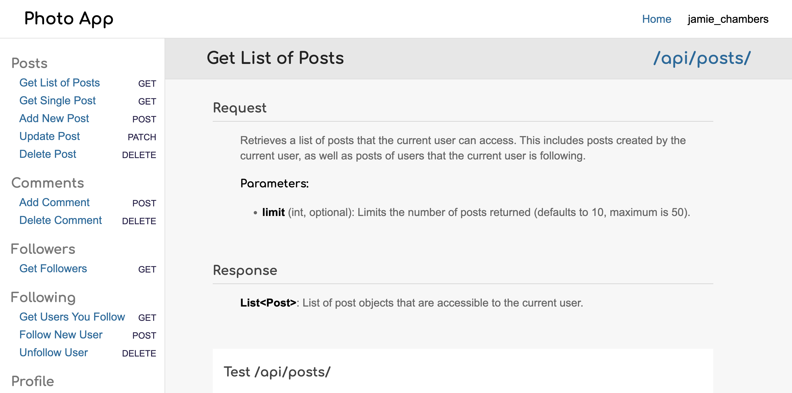
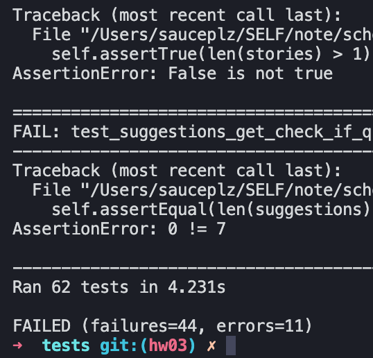
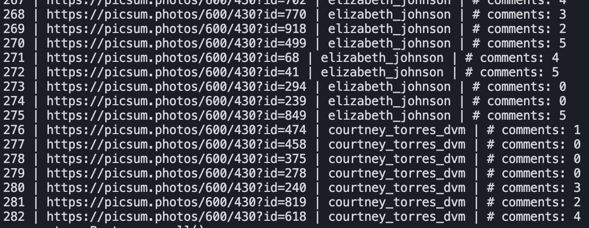
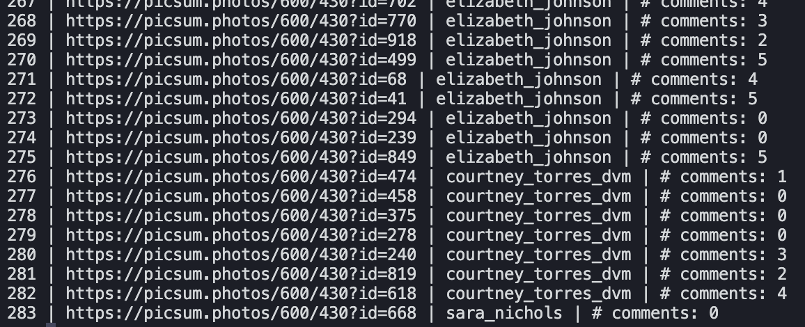
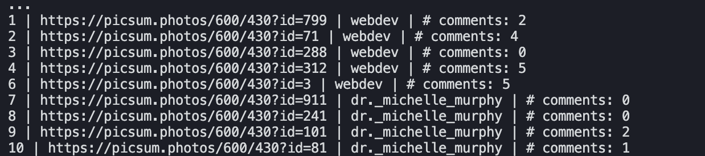
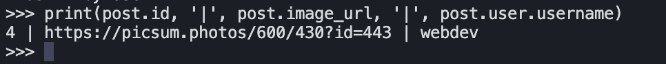

# API

# Python Test

# CREATING (creating 283) & READING (reading all)

# UPDATING (update 4) & DELETEING (delete 5)

- What is the value of SQLAlchemy? Modularize (make pluggable) the database solution.
- What is a model? The python code that interacts with a table within SQL context.
- What is a view? like a macro, used in combination with other sql statements.
